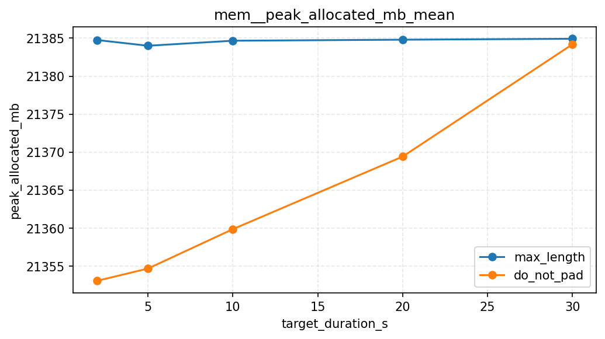
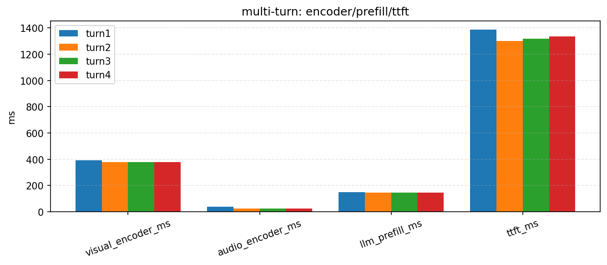

# FasterOmni

**Accelerating On-Device LMM Reasoning via Example-Free Middleware**

[](https://www.python.org/)
[](https://pytorch.org/)
[](https://github.com/holEeast979)

> **"Nothing is faster than doing nothing."** — Eliminating structural waste in Omni-modal LMM inference.

## Introduction

This project presents **FasterOmni**, a lightweight, non-intrusive middleware designed for **On-Device Omni-modal LMMs** (e.g., Qwen2.5-Omni). Unlike server-side engines (vLLM, SGLang) that focus on throughput, FasterOmni addresses the **Time-To-First-Token (TTFT)** and **Memory Peak** bottlenecks in single-request, resource-constrained environments.

**Target Model:** Qwen2.5-Omni-7B (extending to smaller models for generalization validation)

**Benchmarks:** Video-MME, ActivityNet-QA, AudioCaps

---

## Why Existing Architectures Fail on Edge?

Our profiling on **Qwen2.5-Omni-7B** reveals three structural inefficiencies that SOTA methods (vLLM, ToMe, etc.) fail to address:

### 1. The Amdahl's Law Bottleneck in Prefill

While existing engines optimize the decoding stage, our breakdown shows that **Preprocess & Encoding dominate the TTFT latency** in multimodal tasks.

<p align="center">
  
</p>

- **Fact:** Visual/Audio Encoder + Projector + Glue Code account for **>65% of TTFT**, leaving limited room for Decoder-only optimizations.
- **Insight:** *"Optimization in the wrong place is futile."*

### 2. Audio Padding "Resource Lock"

Whisper-based encoders enforce a **30s padding** (`padding=max_length`), causing short audio clips to consume 6x compute and memory.

| Audio Duration | Padding Overhead | Extra VRAM |
| :--- | :--- | :--- |
| 2s | 15x | ~30-40MB |
| 5s | 6x | ~20MB |
| 10s | 3x | ~10MB |

- **Evidence:** A 2s audio clip consumes ~30-40MB extra VRAM purely due to padding, creating a "memory floor" that locks out low-end devices.

<p align="center">
  
</p>

### 3. The "Groundhog Day" of Multi-turn Conversation

Native `generate()` pipelines lack cross-turn encoder caching.

| Turn | Visual Encoder | Audio Encoder | LLM Prefill |
| :--- | :--- | :--- | :--- |
| Turn 1 | ✅ Run | ✅ Run | ✅ Run |
| Turn 2 | ❌ Re-run | ❌ Re-run | ❌ Re-run |

- **Observation:** Turn 2 latency ≈ Turn 1 latency. The visual and audio encoders (and their expensive projections) are re-executed for the same video every single turn.

<p align="center">
  
</p>

---

## Comparison with SOTA

| Approach | Optimization Target | Level | Cross-turn Cache? | Audio Padding Fix? |
|----------|---------------------|-------|-------------------|--------------------|
| vLLM / SGLang | Server Throughput | Engine (High) | ❌ No | ❌ No |
| ToMe / Vid-TLDR | Visual Pruning | Operator (High) | ❌ No | ❌ No |
| Faster-Whisper | ASR Speed | Stack Replacement | ❌ N/A | ❌ No |
| **FasterOmni (Ours)** | **On-Device TTFT** | **Middleware (Low)** | ✅ **Yes (O(1))** | ✅ **Yes (Zero-Pad)** |

---

## Methodology & Progress

### Phase 1: Motivation Experiments ✅ (Completed)
Developed profiling tools and benchmark framework to identify performance gaps:

- **Unified Benchmark Framework:** Spec-based runner for reproducible experiments
- **TTFT Breakdown:** Decomposed TTFT into visual/audio encoding, projection, LLM prefill, and decode stages
- **Defect Verification:** Quantified audio padding waste (~30-40MB per short clip) and multi-turn redundancy

### Phase 2: Middleware Implementation (Active)
Designing a non-intrusive middleware layer:

- [ ] **Dynamic Audio Stripping:** Variable-length audio encoding to remove padding overhead
- [ ] **Semantic Cache Manager:** Hook into `forward()` to cache visual/audio embeddings across turns
- [ ] **Projection Optimization:** Analyze and optimize "Glue Code" latency (741.6ms in profiling)

### Phase 3: Generalization Validation (Planned)
Validate middleware on smaller models (Qwen2.5-Omni-3B) to ensure generalization.

---

## Quick Start

### Installation

```bash
git clone https://github.com/holEeast979/On-Device-LMM-Reasoning-Acceleration.git
cd On-Device-LMM-Reasoning-Acceleration
pip install -r requirements.txt
```

### Download Models & Data

```bash
# Prepare datasets using dedicated scripts
# Video-MME (requires yt-dlp for YouTube downloads)
python tools/prepare_video_mme.py --out-root /root/autodl-tmp/data --max-samples 100 --validate

# ActivityNet-QA
python tools/generate_activitynet_manifest.py

# AudioCaps (requires audiocaps-download package)
python tools/prepare_audiocaps.py --out-root /root/autodl-tmp/data --max-samples 100 --validate
```

**Dataset Statistics** (current setup):
| Dataset | Videos/Audios | QA Pairs | Size |
|---------|---------------|----------|------|
| Video-MME | 100 videos | 2700 QA | ~12GB |
| ActivityNet-QA | 103 videos | - | ~1.7GB |
| AudioCaps | 100 audios | - | ~120MB |

### Run Experiments

```bash
# Unified benchmark runner (spec-based)
python benchmark/run.py audio-padding --manifest /root/autodl-tmp/data/video_mme/manifest.csv
python benchmark/run.py multiturn --manifest /root/autodl-tmp/data/video_mme/manifest.csv
python benchmark/run.py token-prefill --manifest /root/autodl-tmp/data/video_mme/manifest.csv

# Run individual experiments
python exp/exp1_serial_vs_parallel.py      # Serial vs parallel encoding
python exp/exp2_ttft_breakdown.py          # TTFT breakdown analysis (core)
python exp/exp3_dual_gpu_parallel.py       # Dual-GPU parallel encoding
python exp/exp4_defect_verification.py     # Audio padding + multi-turn defects (core)
```

### Usage: Profiling an LMM

Use our profiler to analyze Qwen2.5-Omni's bottleneck:

```python
from profiling_utils import TorchCudaMemPeakMonitor, Timer
import common as C

# Load Model
model, processor = C.load_qwen25_omni("/path/to/Qwen2.5-Omni-7B", dtype="bf16")

# Attach memory monitor
mem_monitor = TorchCudaMemPeakMonitor()
mem_monitor.start()

# Run inference with timing
with Timer("generate"):
    output = model.generate(**inputs)

# Get memory stats
mem_monitor.stop()
print(f"Peak GPU memory: {mem_monitor.peak_allocated_bytes / 1e9:.2f} GB")
```

**Sample TTFT Breakdown Output:**

```
[TTFT Breakdown]
Total TTFT: 1850ms
------------------------------------------------
| Stage              | Time (ms) | % Total |
|--------------------|-----------|---------|
| Video Encoder      | 850.0     | 45.9%   |
| Audio Encoder      | 520.0     | 28.1%   |  <-- PADDING WASTE
| LLM Prefill        | 450.0     | 24.3%   |
| First Token Decode | 30.0      | 1.6%    |
------------------------------------------------
```

---

## Project Structure

```
├── benchmark/                # Unified benchmark framework (runner + specs)
│   ├── run.py                # CLI entry
│   ├── runner.py             # Shared runner utilities
│   └── specs/                # Spec-based experiments (audio-padding/multiturn/token-prefill)
├── common.py                 # Shared utilities and model loaders
├── profiling_utils.py        # Shared profiling utilities (timers/monitors/hooks)
├── exp/                      # Experiment scripts
│   ├── exp1_serial_vs_parallel.py    # Serial vs parallel encoding comparison
│   ├── exp2_ttft_breakdown.py        # TTFT breakdown analysis (core)
│   ├── exp3_dual_gpu_parallel.py     # Dual-GPU parallel encoding
│   └── exp4_defect_verification.py   # Audio padding + multi-turn defects (core)
├── tools/                    # Data preparation and helper scripts
│   ├── prepare_video_mme.py
│   ├── prepare_audiocaps.py
│   ├── prepare_msvd_qa.py
│   └── datasets/             # Manifest utilities
└── docs/                     # Documentation
    ├── benchmark-framework.md
    ├── dataset-tools.md
    └── experiments.md
```

---

## Roadmap

- [x] **Motivation Experiments:** Identify structural inefficiencies not covered by vLLM/ToMe/etc.
- [x] **TTFT Breakdown Analysis:** Decompose latency into encoder/projection/prefill/decode stages
- [x] **Benchmark Framework:** Unified spec-based runner for reproducible experiments
- [ ] **FasterOmni Middleware v1:** Dynamic audio stripping + semantic cache manager
- [ ] **Generalization Validation:** Test on Qwen2.5-Omni-3B and other edge models

---

## Author

**Haodong Zhang (HolEast)**

- Incoming MSc Student @ CUHK
- Focus: Edge AI, LLMOps, Applied LLMs
- [Portfolio & Resume](https://github.com/holEeast979)

---

## Contributing

This is an active research project. Feedback and discussions are welcome! If you are interested in Edge AI collaboration, feel free to reach out via email.

---

## License

This project is licensed under the MIT License - see the [LICENSE](LICENSE) file for details.
